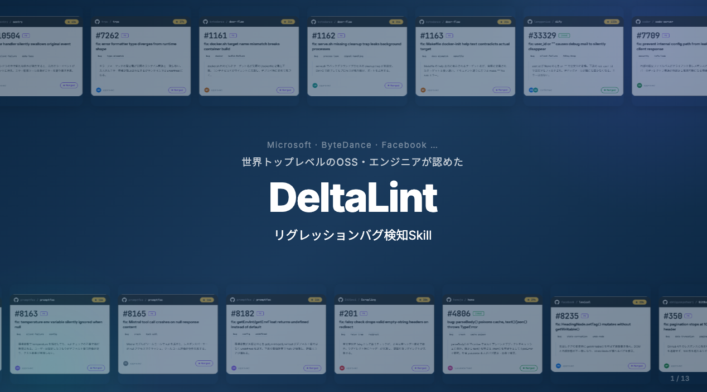
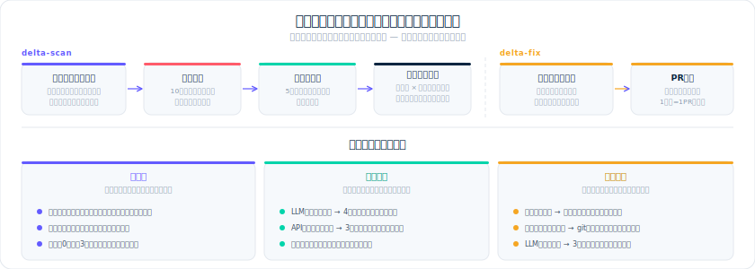
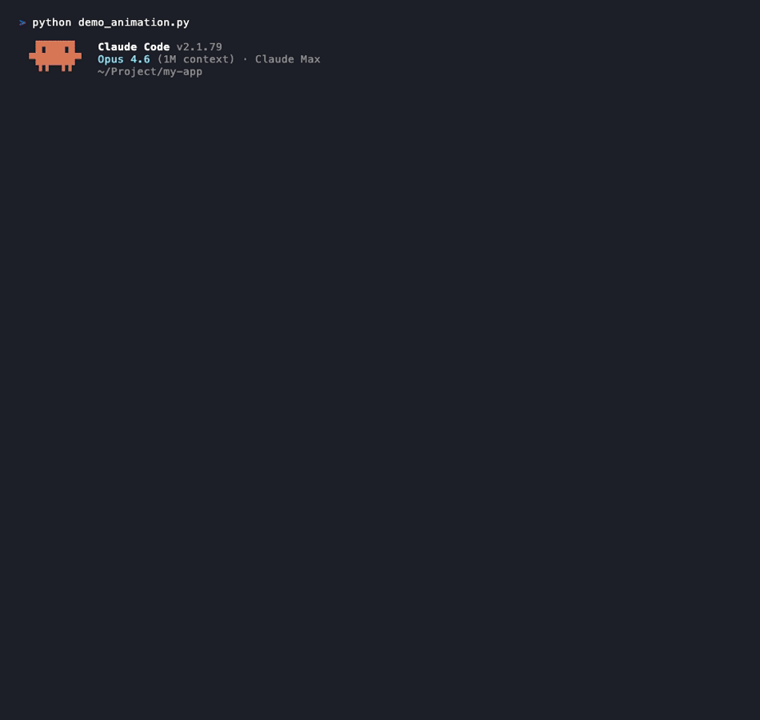

<p align="center">
  
</p>

# DeltaLint

## リグレッションバグの検出を、エンジニアリングする

**機能改修したら、想定してない箇所でバグが発生しました。**<br>
**—— DeltaLint はその「壊れる場所」を特定します。**

普通のリンターやテストでは見つからない**構造矛盾**（モジュール間の暗黙の前提の食い違い）を自動検出。<br>
検出率 98.4%（62/63 リポ）、真陽性率 91%（92/101 件）、修正 PR マージ率 96.6%（28/29 件）。

---

## 3つの使い方

### 1. Claude Code プラグイン（ローカル）

```bash
claude plugin marketplace add karesansui-u/delta-lint
claude plugin install delta-lint@delta-lint
```

```
delta-scan                    # 直近3ヶ月の変更ファイルを自動スキャン
delta-fix                     # 優先度上位3件を自動修正 → PR
delta-fix --ids dl-xxxxxxxx   # 特定の finding を修正
```

### 2. GitHub App（PR ごとに自動レビュー） — *Coming Soon*

リポジトリに DeltaLint GitHub App をインストールするだけ。設定ファイル不要。

- **PR を開くと自動スキャン** → インラインコメントで指摘 + 修正方針を提示
- `/delta-scan` `/delta-review` コメントで手動トリガーも可能
- OSS リポジトリは無料

> 現在セルフホスト可能。Marketplace 公開準備中。セットアップ: **[GitHub App SETUP.md](plugins/delta-lint/app/SETUP.md)**

### 3. GitHub Actions（CI パイプライン）

```yaml
- uses: karesansui-u/delta-lint@main
  with:
    mode: review          # review | suggest | scan
    fail_severity: high   # CI を落とす閾値
```

> SARIF 出力 → GitHub Code Scanning 連携にも対応。

---

## 6つの検出パターン

| # | パターン | 例 | なぜ起きる |
|---|---------|---|-----------|
| ① | **非対称デフォルト** | 会員登録で名前を空欄にするとプロフィール画面に「null」と表示される | 保存と表示で「空」の扱いが違う<br>*← 入力パスと出力パスでデフォルト値が非対称* |
| ② | **意味的不一致** | 注文ステータス「0」が画面Aでは「未処理」、画面Bでは「キャンセル済」になる | 同じ名前が場所によって別の意味<br>*← 共有名の意味がモジュール間で暗黙に分岐* |
| ③ | **仕様乖離** | 「全APIに認証必須」と書いてあるが認証なしで叩けるAPIがある | ドキュメントと実装がズレている<br>*← 仕様と実装の同期が手動依存で維持されない* |
| ④ | **ガード欠落** | 新規投稿にはXSS対策があるが編集画面にはない | 片方のパスだけチェックが抜けている<br>*← 並行パスへのガード伝搬が保証されない* |
| ⑤ | **設定干渉** | セッション有効期限30分 × 自動保存間隔40分で下書きが毎回消える | 独立に見える設定が裏で矛盾する<br>*← 設定間の暗黙の制約が文書化されていない* |
| ⑥ | **順序依存** | ログイン直後だけ「あなたへのおすすめ」が他人のデータで表示される | 特定の条件で実行順が入れ替わる<br>*← 実行順序の前提がコードに明示されていない* |

共通する原因：**開発者はスコープを絞って作業する**。機能Aを修正してテストが通れば完了。しかし機能Aと暗黙の前提を共有する機能Bが壊れていないかは、誰もチェックできていない可能性がある。DeltaLint はこの「スコープ外」を狙って検出する技術。

---

## アーキテクチャ

<p align="center">
  
</p>

```
PR / push / コメント
  ↓
Webhook or GitHub Actions
  ↓
scanner.scan()  ← 6パターン検出パイプライン
  ├── context 収集 → detect → verify → filter
  └── severity / scope / lens で制御
  ↓
結果出力
  ├── PR インラインコメント（GitHub App）
  ├── PR レビュー / Check Run（Actions）
  ├── SARIF → Code Scanning
  └── ダッシュボード HTML（ローカル）
```

> 詳細: **[アーキテクチャ設計書](plugins/delta-lint/README.md)** | **[モジュールマップ](plugins/delta-lint/ARCHITECTURE.md)** | **[設計判断記録（ADR）](plugins/delta-lint/docs/decisions/)** | **[インタラクティブ図](https://karesansui-u.github.io/delta-lint/docs/architecture-diagram.html)**

---

## 背景技術

この技術は、下記の論文を応用しています。

> [構造持続の最小形式 — 制約蓄積による構造損失の最小形式 —](https://zenodo.org/records/19584667)<br>

ソフトウェア本体を構造物と捉えて、前提の仕様やコードの矛盾をバグとして炙り出すという理論応用になります。

LLM 11モデル・5ベンダーでの実験と、SAT問題での数学的検証により、構造矛盾が蓄積するとシステムの健全性は**指数関数的に**崩壊する（足し算ではなく掛け算）ことを確認しています。

---

## AGIラボ ハッカソン 2026＠GMO Yours — 3位入賞

**OSS貢献実績（2026/3/13〜3/23）: PRマージ 16件（12リポ）**

| 対象リポ | Stars | 結果 |
|---------|-------|------|
| microsoft/playwright | 70K | PRマージ 1件 — [#39744](https://github.com/microsoft/playwright/pull/39744) |
| microsoft/fluentui | 19K | PRマージ 1件 — [#35877](https://github.com/microsoft/fluentui/pull/35877) |
| facebook/lexical | 20K | PRマージ 1件 — [#8235](https://github.com/facebook/lexical/pull/8235) |
| bytedance/deer-flow | 31K | PRマージ 3件 — [#1161](https://github.com/bytedance/deer-flow/pull/1161) [#1162](https://github.com/bytedance/deer-flow/pull/1162) [#1163](https://github.com/bytedance/deer-flow/pull/1163) |
| promptfoo/promptfoo | 16K | PRマージ 3件 — [#8163](https://github.com/promptfoo/promptfoo/pull/8163) [#8165](https://github.com/promptfoo/promptfoo/pull/8165) [#8182](https://github.com/promptfoo/promptfoo/pull/8182) |
| getsentry/sentry | 43K | PRマージ 1件 — [#110504](https://github.com/getsentry/sentry/pull/110504) |
| coder/code-server | 77K | PRマージ 1件 — [#7709](https://github.com/coder/code-server/pull/7709) |
| trpc/trpc | 37K | PRマージ 1件 — [#7262](https://github.com/trpc/trpc/pull/7262) |
| D4Vinci/Scrapling | 30K | PRマージ 1件 — [#201](https://github.com/D4Vinci/Scrapling/pull/201) |
| abhigyanpatwari/GitNexus | 17K | PRマージ 1件 — [#350](https://github.com/abhigyanpatwari/GitNexus/pull/350) |
| openclaw/openclaw | 19K | PRマージ 1件 — [#47488](https://github.com/openclaw/openclaw/pull/47488)（提出は上記期間内・マージ 2026/3/29） |
| labstack/echo | 32K | PRマージ 1件 — [#2925](https://github.com/labstack/echo/pull/2925)（提出 2026/3/25・マージ 2026/3/29／上記期間終了直後） |

**PRマージ 16件（12リポ）** / Issue起因マージ 2件（dify 133K, hono 29K） / セキュリティ脆弱性報告 4件 / リジェクト 1件



---

## 環境と自律セットアップ

- 初回の `scan` でも **対話で「インストールしますか？」とは聞かない**。不足している CLI や Python パッケージは **標準エラーに警告を出しつつ**、環境に応じて `npm` / `pip` / `brew` / `conda` などで **自動取得を試行**する。失敗したら **別バックエンドや機能スキップ**に落として処理を続ける。
- スクリプトが使う Python は **ユーザーマシン上のインタプリタ**（Claude 本体の内部環境ではない）。
- Issue/PR 連携や `delta-fix` など GitHub 操作をフルで使う場合は、**`gh` のインストールと `gh auth login`（認証済み状態）が必要**。スキャン単体は `gh` なしでも動作します。


### 情報量（nats）でいう「矛盾の重さ」— 理論の実用化

論文側では「制約の蓄積」と情報損失を結びつけています。DeltaLint のダッシュボードやスキャン完了レポートに出る **δ（デルタ）** は、その考え方を **リポジトリ単位のスカラー**に落とした実装です。ポイントだけ、やや細かめに書きます。

1. **セルごとの情報量 I（単位: nats）**
   各 (検出パターン ①〜⑥ × severity) について、校正実験（コード断片のみ vs 注釈付き）で LLM の正答率の比 `acc_A / acc_B` を取り、
   `I = -ln(acc_A / acc_B)`（改善しない場合は 0）として **「文脈を足すとどれだけ当たりやすくなるか」** を nats で表現します。
   これが **I_BASE** テーブルに格納される **キャリブレーション済み**の値です。パターン ⑦以降などテーブルにないセルは、正のセルの中央値を **fallback** として使います（便宜値であり実測ではない）。

2. **リポジトリ全体の δ_repo**
   アクティブな finding ごとに、その (pattern, severity) の I を **足し算**して
   **δ_repo = Σ I** [nats]
   とします（ストレステスト由来の特定パターンは δ の対象から除外するなど、意味が混ざらないよう分離）。
   **件数だけではない重み付け**がここに入ります。同じ 1 件でも、パターン②の medium（高い I）と、表面検出で I≈0 に近いセルでは δ への寄与が変わります。

3. **e<sup>−δ</sup> と健全性バロメータ**
   δ を「観測できていない文脈情報の蓄積（ナット単位）」とみなすと、**e<sup>−δ</sup>** は 0〜1 の **残存因子**として解釈しやすく、ダッシュボードの 🟢〜💀 の帯と対応づけています。論文の「指数関数的に効く」というメタファと、表示上の e<sup>−δ</sup> は同じ指数ファミリーです（定義は実装の [info_theory.py](plugins/delta-lint/scripts/info_theory.py) に集約）。

4. **δ_repo（全体）と δ_cal（キャリブレーション分のみ）**
   **δ_repo** は fallback を含む **合計**。**δ_cal**（`delta_repo_calibrated`）は **I_BASE に実測セルがある寄与だけ**の部分和です。
   未校正パターンが多いリポでは、fallback が δ_repo を押し上げ、**外部の事実（例: 開いている bug 系 issue 数など）との相関がぼやける**ことがあります。一方で **δ_cal はそのノイズを隔離**しやすいです。

5. **Phase 1 実証（予備）**
   複数 OSS リポに対し、外部プロキシと Spearman 相関を取った **予備研究（例: N=12）**では、**δ_cal だけが統計的に有意な正の相関**を示し、δ_repo（全体）や単純な active 件数では有意差が出ない、という結果が得られています（詳細・手順は [docs/phase1-delta-repo-validation.md](docs/phase1-delta-repo-validation.md)）。
   サンプルが小さいので決定打ではありませんが、**「検証・閾値の議論は δ_cal 中心」**という方針と、**「件数ではなく情報量で足す意味」**を裏付ける材料になります。

ダッシュボードでは **総 δ・δ_cal・未校正寄与の目安（割合）**を併記し、数値の読み分けができるようにしています。

## License

Apache License 2.0 — 詳細は [LICENSE](LICENSE) を参照。
